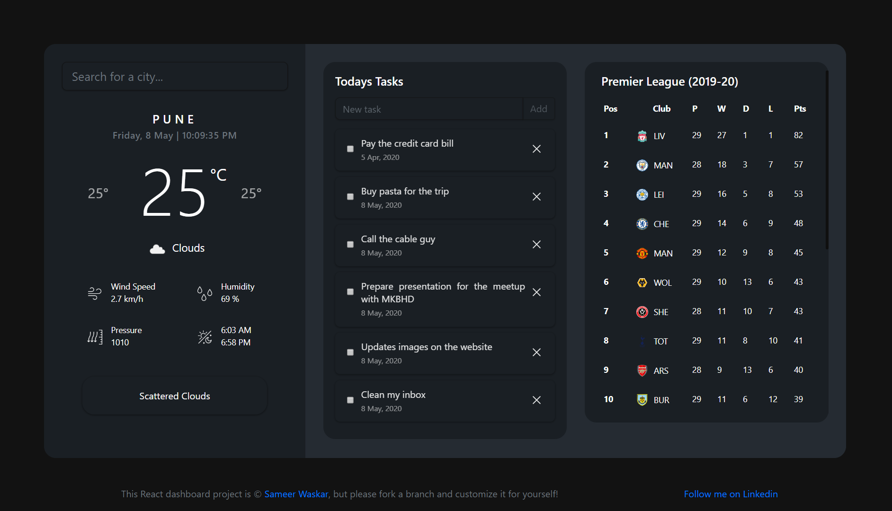

# Welcome to SW-PARKING!

A simple dashboard app consisting of 3 small **React** learner project.

 - **Weather** app with live timer.
 - **Premier League table** with live updates.
 - **Todo app** with dark skin.

Build with:

 - [React.js](https://reactjs.org/)
 - [Bootstrap 4](https://getbootstrap.com)
 - [Open Weather API](https://openweathermap.org/)
 - [Football Data Org](https://www.football-data.org/documentation/quickstart)

## Getting Started
1. Install dependencies

  	`npm install`

2. Fire up the server and watch files

	`yarn start`

Runs the app in the development mode. Open [http://localhost:3000](http://localhost:3000) to view it in the browser.

The page will reload if you make edits. You will also see any lint errors in the console.
